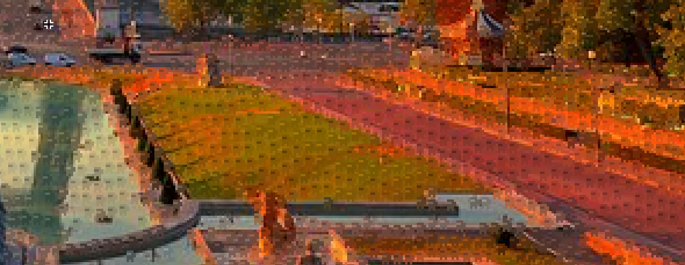

# Sprite map maker
Aseprite script that allows you to create sprite maps by connecting frames in your animation(I wish I had known that this feature already existed) or duplicating the current frame.

# Amogusinator
Hides amoguses in your sprite like people in r/place did

