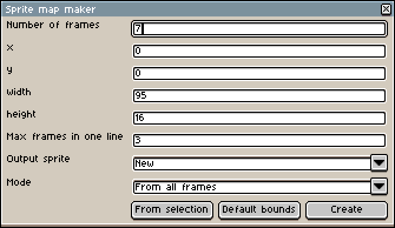

# Sprite map maker
Aseprite script that allows you to create sprite maps by connecting frames in your animation(I wish I had known this feature already existed) or duplicating the current frame.

# Amogusinator
Hides Among Us characters in your sprite.

# Sandbox
Makes pixels have gravity!

